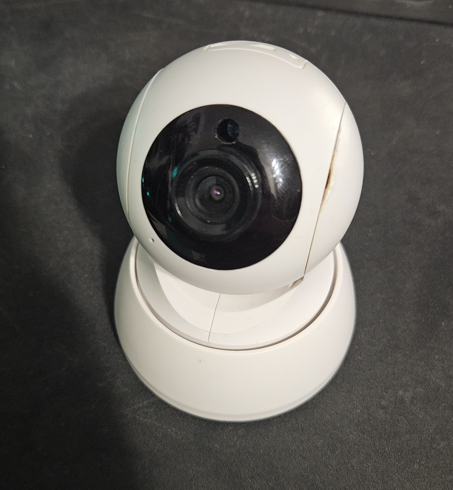
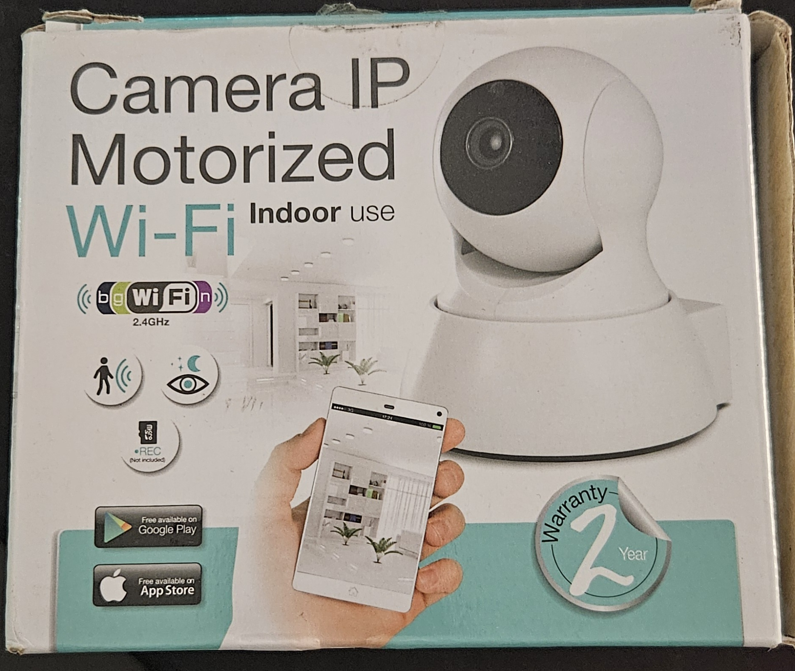

# Anyka AK39 Camera Rescue & Custom Firmware Guide

**Don't let your camera become e-waste!**

This repository provides a reproducible, community-driven workflow to rescue and unlock IP cameras based on the Anyka AK39-family SoC (such as the AK3916 and AK3918). 

Many of these cameras stopped working entirely when their original manufacturers dismissed the proprietary cloud endpoints required for the cameras to operate. The stock firmware natively supports standard local video protocols like **RTSP** and **ONVIF**, but these features are artificially locked behind a "Smart Cloud Connection" boot gate. If the camera cannot reach the dead cloud servers, it refuses to launch local services.

The purpose of this repository is to help owners unlock their hardware, bypass the defunct cloud check, and restore full functionality over the local network using standard RTSP and ONVIF clients (like VLC, OBS, AgentDVR, or standard NVRs). 

It documents the complete process, focusing on:
- Gaining root shell access to the camera.
- Reverse engineering and patching the `anyka_ipc` daemon to bypass the cloud check.
- Injecting startup hooks to dynamically fix ONVIF streaming paths.
- Repacking and safely flashing the `usr.sqsh4` filesystem.

> **Note:** This repository assumes owner-authorization and intentionally excludes credential/authentication bypass procedures.

## Device profile used as reference

Here are reference images of the camera model (based on the Anyka SoC) used to test this unlock procedure:

  
  

- SoC family: Anyka AK39 (ARMv5)
- Kernel observed: Linux `3.4.35`
- Userspace: BusyBox-style embedded Linux
- Storage/mount model:
  - `/` rootfs squashfs (read-only)
  - `/usr` squashfs (`/dev/mtdblock2`, read-only)
  - `/etc/jffs2` jffs2 (`/dev/mtdblock3`, read-write config)
  - `/mnt` SD card
- Camera daemon binary: `/usr/bin/anyka_ipc`
- Startup wrapper: `/usr/sbin/anyka_ipc.sh` (inside `usr.sqsh4` as `/sbin/anyka_ipc.sh`)

## Repository Layout & Navigation Guide

This project is organized into sequential chapters. If you are starting with a new camera, begin with Chapter 0:

- [**Chapter 00: Gaining Access**](docs/00-anyka-gain-access.md) — How to gain a root shell via FTP, replace the shadow password file, and access Telnet.
- [**Chapter 01: Device Profile & Specifications**](docs/01-device-specs.md) — Overview of hardware, filesystem layout, and partitions.
- [**Chapter 02: Host Toolchain & Prerequisites**](docs/02-toolchain-and-prereqs.md) — Installing necessary cross-compilation and extraction tools.
- [**Chapter 03: Binary Patching `anyka_ipc`**](docs/03-anyka_ipc-binary-patch.md) — Step-by-step reverse engineering guide to bypass the cloud initialization (SCC) gate.
- [**Chapter 04: Startup Hooks & Seeding Wi-Fi**](docs/04-firmware-customizations.md) — Customizing the boot wrapper, patching ONVIF stream URLs dynamically, and provisioning Wi-Fi.
- [**Chapter 05: Unpacking & Repacking Firmware**](docs/05-build-and-pack.md) — Extracting `usr.sqsh4`, copying scripts, and repacking the image.
- [**Chapter 06: Flashing & Post-Boot Validation**](docs/06-flash-and-validate.md) — Upgrading via SD card and testing network services.
- [**Chapter 07: Troubleshooting**](docs/07-troubleshooting.md) — Diagnosing common failure modes (Wi-Fi, startup loops, ONVIF/RTSP issues).
- [**Helper Scripts (`scripts/`)**](scripts/) — Collection of shell scripts used for startup hooks and custom configurations.

## Acknowledgments & Community Resources

I'd like to mention and credit the extensive work documented at [Gerge's Anyka AK3918 Hacking Journey](https://gitea.raspiweb.com/Gerge/Anyka_ak3918_hacking_journey/). That repository has produced invaluable materials, research, and tools related to Anyka SoC-based cameras for the broader community.

